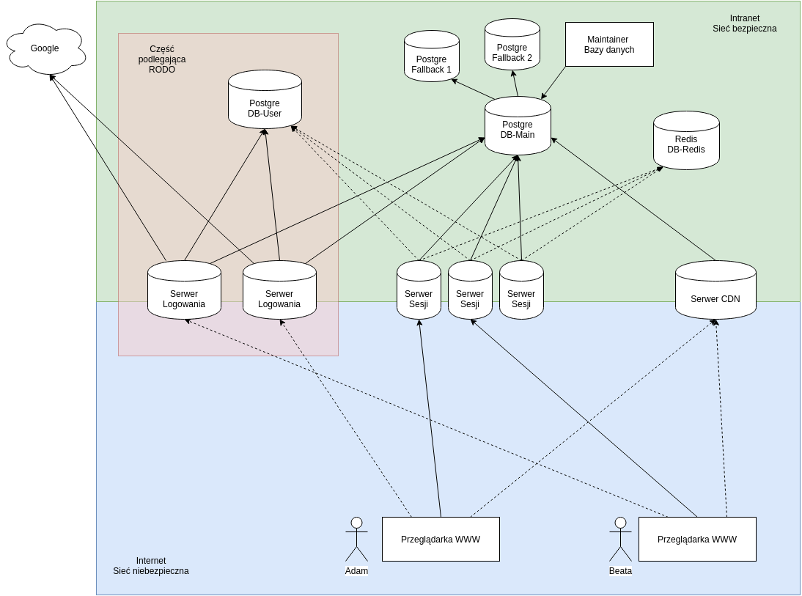
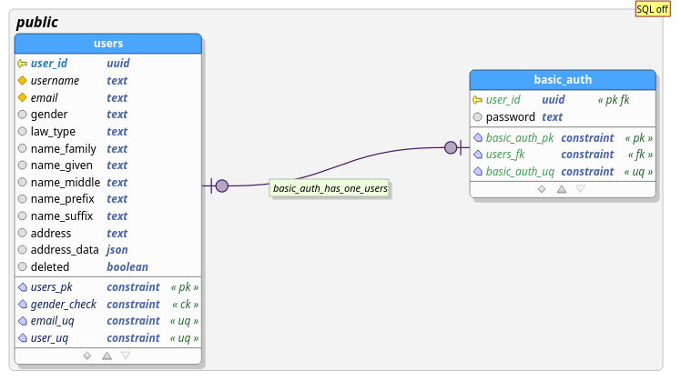
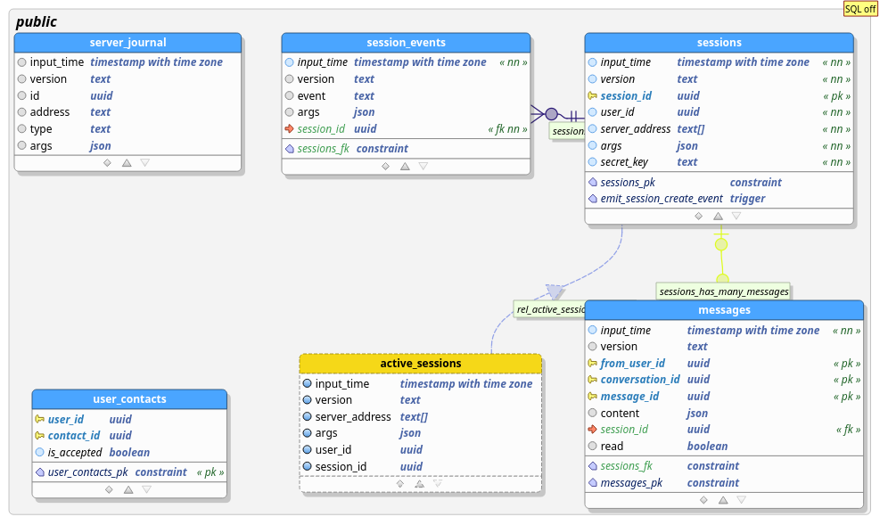
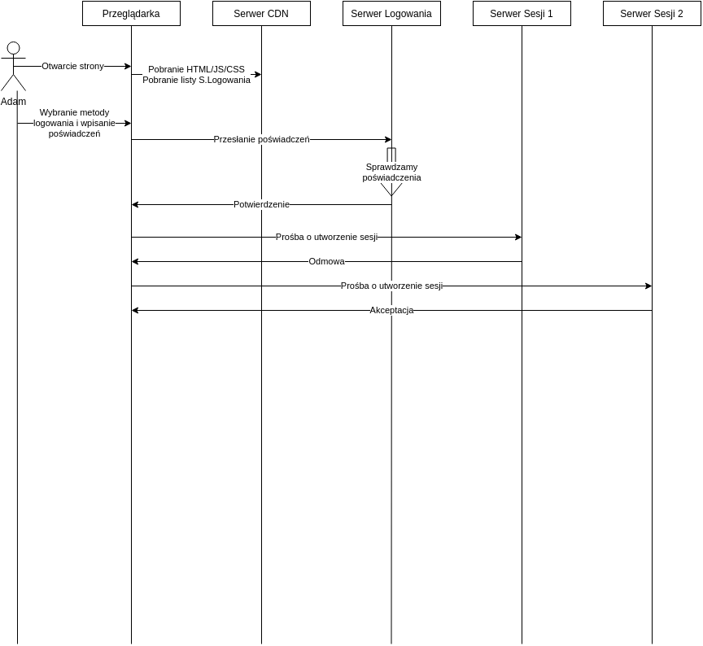
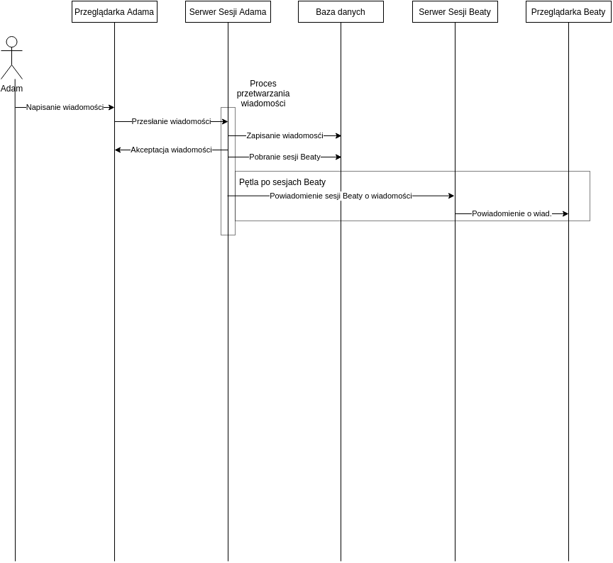

## Opis ogólny

Chat składający się z trzech serwerów: logowania, sesji i cdn.
Architektura będzie umożliwiała użytkownikowi zalogowanie się na swój profil za pomocą kilku metod logowania.

Na początku łączy się z serwerem cdn, aby pobrać frontend, następnie do serwera logowania, przesyła poświadczenia, a ten zwraca mu adres serwera sesji z którym ma się połączyć.
Dzięki temu będzie możliwość wielokrotnego łączenia się na to samo konto, np. z różnych urządzeń.
Crash jednego serwera nie wpłynie na działanie pozostałych, już uruchomionych.

## Definicje

### Osoba

Wyróżniamy osoby `user(s)`, które odpowiadają fizycznym.
Osoby fizyczne mają kilka metod logowania(np. prze Googla/Facebook'a).

### Logowanie 

Metoda logowania `authMethod`, to sposób na uwierzytelnienie użytkowników aplikacji.
W aplikacji przewiduje istnienie wielu metod logowania.
Każda metoda autoryzacji ma nazwę `name` i parametry `options`.`

### Sesja

Sesja `session` jest to fizyczne połączenie zalogowanego użytkownika z aplikacją klienta.
Sesja ma  identyfikator `id` i klucz `secretKey`, który jest tokenem to uwierzytelnienia.

### Wiadomość

Wiadomość `message` jest to wypowiedz użytkownika.
Parametry wiadomości:
 - czas dostarczenia do serwera `read_time`

   jest to czas kiedy serwer dostał wiadomość

 - czas napisania przez użytkownika `app_time`

   jest to czas kiedy wiadomość była napisana
  
 - źródło `from`, które określa od kogo zostało nadane

   będzie to id użytkownika

 - adresat `to:{type,id}`, z określonym typem i id adresata

   Na przykład `to:{type:"user",id:"XYZ"}`, `to:{type:"group",id:"123"}`.
   Implementujemy tylko typ `"user"`.

 - treść `content: (string|object)[]`
  

## Baza danych

### Baza użytkowników

Ta baza podlega pod RODO.

 

#### Tabela ludzi:

Tabela zawiera podstawowe informacje o użytkowniku.
Zawiera również flagę oznaczającą usunięcie użytkownika.

 - `id:uuid` - id użytkownika
 - `nation:text` - informacja o nacji(kulturze), czy ma tekst od prawej do lewej itp.
 - `name_family:text` - składowa imienia
 - `name_given:text` - składowa imienia
 - `name_middle:text` - składowa imienia
 - `name_prefix:text` - składowa imienia
 - `name_suffix:text` - składowa imienia
 - `address:text` - adres
 - `deleted:boolean=false` - flaga usunięcia konta

Wszystkie, za wyjątkiem `id` i `deleted` mogą być null, co będzie oznaczało, że konto jest usunięte
 
#### Tabele dla metod logowania

Dla każdego logowania będzie dostępna osobna tabela, jeżeli taka będzie potrzebna.

  
### Baza wiadomości i wszystkiego innego:

#### Tabela sesji

Każda sesja musi być odnotowana.

#### Tabela historii sesji

Do tej tabeli sesje z użytkownikiem będą raportować swój stan.
Tak aby można było określić, kto kiedy się logował.

#### Tabela wiadomości

Tabela przechowuje historyczne wiadomości.

## Serwery

Wszystkie komunikacje odbywają się za pośrednictwem funkcji [`fetch`](node-fetch).
Parametry przesyłane po `POST`.
W dalszej części będę adresy URL pisał jakby miały GET, ale będzie się to odnosiło do POST.

Wszystkie serwery komunikacji będą stały na [`expressjs`](https://expressjs.com/) oraz socketIO do subskrypcji danych.

### Komunikacja

Komunikacja `serwer:serwer` i `klient:serwer` wygląda następująco.

### Serwer CDN

Serwer przechowuje i udostępnia pliki takie jak: html, js, css, png, json.
Dodatkowo przechowuje informacje o obecnie dostępnych serwerach logowania.
Serwerów CDN, może być kilka.

### Serwer logowania

Jest to serwer odpowiadający za logowanie i tworzenie sesji dla użytkowników.
Użytkownik łączy się z serwerem przekazuje mu poświadczenia, czyli nazwę metody autoryzacji `authMethod.name` i parametry `authMethod.options`.
Jeżeli serwer potwierdził autentyczność użytkownika, tworzy tworzy sesje na serwerze sesji, wysyła id i klucz sesji do użytkownika.
Komunikacja polega na pojedynczych zapytaniach REST.
Komunikacja z logowania sesji jest opisana w pliku `./src/share/MessagingSchema.ts`

### Serwer sesji

Serwer ten odpowiada za komunikacje z użytkownikiem, przyjmowaniem nowych wiadomości i odpowiadanie na zapytania użytkownika.
Użytkownik łączy się z serwerem i podaje klucz sesji.
Komunikacja z serwerem sesji jest opisana w pliku `./src/share/MessagingSchema.ts` 

## Diagramy sekwencji

### Nawiązanie sesji

### Wysłanie wiadomości.

 
## Technologie
 
Do stworzenia części backendowej użyto NodeJS, a do frontendowej użyto biblioteki `React.js`.
Implementując kod w TypeScipt oraz Tsx (frontend).
Jako baza danych została wybrana PostgreSQL.
W celu sprawnego stworzenia szkieletu aplikacji webowej wybrano framework `Express.js`.
Do zoptymalizowania budowania i zarządzania zależnościami wykorzystano Webpack.
Do konteneryzacji projektu wykorzystano Dockera.
