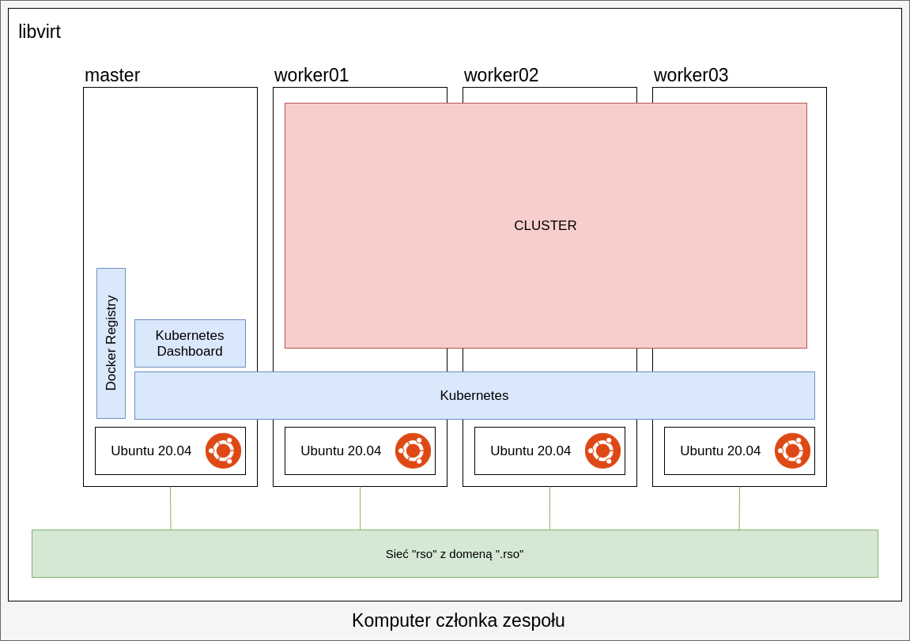

Poniższy tekst prenetuje, sposób na stworzenie clustra na komputerze domowym.



## libvirt

Zainstaluj `libvirt` wraz z klientem graficznym `virt-manager`:

|System|Komenda|
|---|---|
|Ubuntu|`apt-get install qemu-kvm libvirt-daemon-system libvirt-clients bridge-utils virt-manager`|
|ArchLinux|`pacman -S qemu libvirt virt-manager`|

Dodaj samego siebie do grupy `kvm` (niewymagana):
```bash
sudo usermod $(whoami) -a -G kvm
```

Uruchom serwis:
```bash
sudo systemctl enable --now libvirtd.service
```

Utwórz sieć o nazwie `rso`, przykładowy XML sieci:
```xml
<network connections="4">
  <name>rso</name>
  <uuid>47c10b95-6fff-49b1-a045-c1cd3186edfb</uuid>
  <forward mode="nat">
    <nat>
      <port start="1024" end="65535"/>
    </nat>
  </forward>
  <bridge name="virbr1" stp="on" delay="0"/>
  <mac address="52:54:00:d9:d8:7c"/>
  <domain name="rso"/>
  <ip address="192.168.100.1" netmask="255.255.255.0">
    <dhcp>
      <range start="192.168.100.128" end="192.168.100.254"/>
      <host mac="52:54:00:75:bc:3b" name="master" ip="192.168.100.10"/>
      <host mac="52:54:00:a8:aa:95" name="worker01" ip="192.168.100.11"/>
      <host mac="52:54:00:ca:b5:fa" name="worker02" ip="192.168.100.12"/>
      <host mac="52:54:00:d0:f3:8a" name="worker03" ip="192.168.100.13"/>
    </dhcp>
  </ip>
</network>
```

Utwórz cztery maszyny `Ubuntu 20.04`.
Zainstaluj je z serwerem OpenSSH.
Po instalacji:
```bash
apt-get install -y docker.io
systemctl enable docker
curl -s https://packages.cloud.google.com/apt/doc/apt-key.gpg | apt-key add
apt-add-repository "deb http://apt.kubernetes.io/ kubernetes-xenial main"
apt-get install -y kubeadm kubelet kubectl
apt-mark hold kubeadm kubelet kubectl
swapoff –a
# usuń swapa z /etc/fstab
```

Jeżeli nie masz cierpliwości do wpisywania komend, przedstawiam małego haka:
```bash
sleep 2 && xdotool type 'CMD' 
```


## Maszyny Ubuntu 20.04

## Kubernetes

echo "source <(kubectl completion bash)" >> /etc/bash.bashrc

Jeżeli istniał just jakiś już jakiś cluster:
```bash
root $ kubeadm reset
```

Tworzenie clustra
```
root@master $ kubeadm init --pod-network-cidr=10.244.0.0/16
```

Teraz wykonaj następujące komendy, aby dalej nie musieć wpisywać sudo za każdym razem.
```bash
user@master $ mkdir -p $HOME/.kube
user@master $ sudo cp -i /etc/kubernetes/admin.conf $HOME/.kube/config
user@master $ sudo chown $(id -u):$(id -g) $HOME/.kube/config
```
Pod koniec komendy, wyświetli się `kubeadm join ...`, zapisz to.

Zainstaluje dodatek sieciowy, aby pody mogły się komunikować:
```bash
user@master $ kubectl apply -f https://raw.githubusercontent.com/coreos/flannel/master/Documentation/kube-flannel.yml
```

Sprawdź czy wszystkie pody są uruchomione
```bash
user@master $ kubectl get pods --all-namespaces
```

Warto jednak zajrzeć na stronę [github.com](https://github.com/kubernetes/dashboard) w celu zmienienia wersji.

```bash
root@worker $ kubeadm join ...
```

# Instalacja Kubernetes Dashboard

Zainstaluj `Kubernetes Dashboard`:
```bash
user@master $ kubectl apply -f https://raw.githubusercontent.com/kubernetes/dashboard/v2.0.1/aio/deploy/recommended.yaml
```

Następnie stwórz użytkownika `admin-user`:
```bash
user@master $ cat <<EOF | kubectl apply -f -
apiVersion: v1
kind: ServiceAccount
metadata:
  name: admin-user
  namespace: kubernetes-dashboard
---
apiVersion: rbac.authorization.k8s.io/v1
kind: ClusterRoleBinding
metadata:
  name: admin-user
roleRef:
  apiGroup: rbac.authorization.k8s.io
  kind: ClusterRole
  name: cluster-admin
subjects:
- kind: ServiceAccount
  name: admin-user
  namespace: kubernetes-dashboard
EOF
```

Pobierz token uwierzytelniania:
```bash
user@master $ kubectl -n kubernetes-dashboard describe secret $(kubectl -n kubernetes-dashboard get secret | grep admin-user | awk '{print $1}')
```

Zaloguje się do maszyny `master`:
```bash
my@computer $ ssh user@master.rso -L 8001:localhost:8001
```

Uruchom proxy
```bash
user@master $ kubectl proxy
```


Udaj się na stronę:

[`http://localhost:8001/api/v1/namespaces/kubernetes-dashboard/services/https:kubernetes-dashboard:/proxy/#/login`](http://localhost:8001/api/v1/namespaces/kubernetes-dashboard/services/https:kubernetes-dashboard:/proxy/#/login)

## Docker registry

Na masterze utwórz następujące foldery.
```bash
mkdir -p "/docker-registry/data"
mkdir -p "/docker-registry/auth"
mkdir -p "/docker-registry/certs"
```

Utwórz poświadczenia:
```bash
openssl req \
    -newkey rsa:4096 -nodes -sha256 -keyout "/docker-registry/certs/domain.key" \
    -x509 -days 365 -out "/docker-registry/certs/domain.crt"

# dodawanie hasła
htpasswd -Bbn worker kapusta > "/docker-registry/auth/htpasswd"
```

Zapisz do pliku `/docker-registry/docker-compose.yml` następujący tekst:
```yaml
version: "3.3"
services:
  registry:
    restart: always
    image: registry:2
    ports:
      - 5000:5000
    environment:
      REGISTRY_HTTP_TLS_CERTIFICATE: /certs/domain.crt
      REGISTRY_HTTP_TLS_KEY: /certs/domain.key
      REGISTRY_AUTH: htpasswd
      REGISTRY_AUTH_HTPASSWD_PATH: /auth/htpasswd
      REGISTRY_AUTH_HTPASSWD_REALM: Registry Realm
    volumes:
      - /docker-registry/data:/var/lib/registry
      - /docker-registry/certs:/certs
      - /docker-registry/auth:/auth
```

Na każdym komputerze zaloguj się do repozytorium:
```bash 
echo '{
  "insecure-registries" : ["master.rso:5000"]
}' > "/etc/docker/daemon.json"
docker login master.rso:5000
```

Utwórz sekret kubernetesa:
```
kubectl create secret generic rso-docker-registry-login \
    --from-file=.dockerconfigjson=<path/to/.docker/config.json> \
    --type=kubernetes.io/dockerconfigjson
```

## Instalacja i aktualizacja

## Reset clustra
```bash
kubeadm reset

rm -r /etc/cni/net.d
ip6tables --policy INPUT   ACCEPT;
ip6tables --policy OUTPUT  ACCEPT;
ip6tables --policy FORWARD ACCEPT;
ip6tables -Z; # zero counters
ip6tables -F; # flush (delete) rules
ip6tables -X; # delete all extra chains
iptables --policy INPUT   ACCEPT;
iptables --policy OUTPUT  ACCEPT;
iptables --policy FORWARD ACCEPT;
iptables -Z; # zero counters
iptables -F; # flush (delete) rules
iptables -X; # delete all extra chains
```