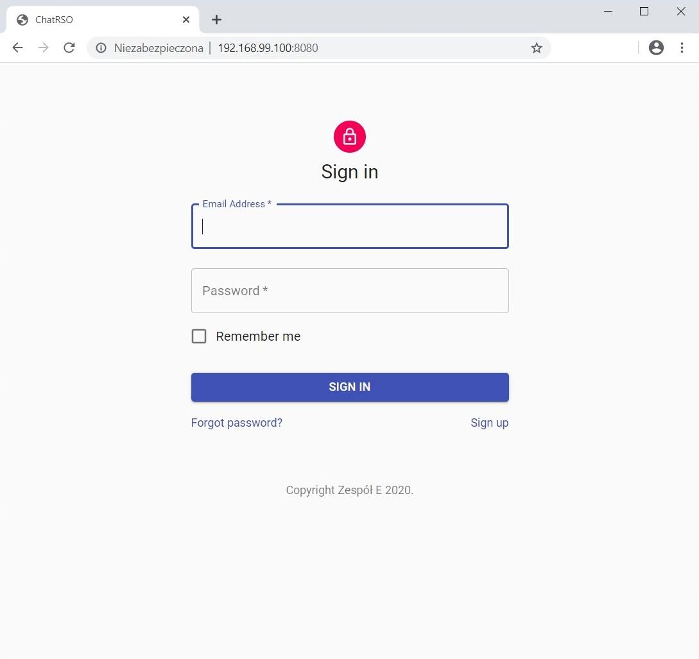
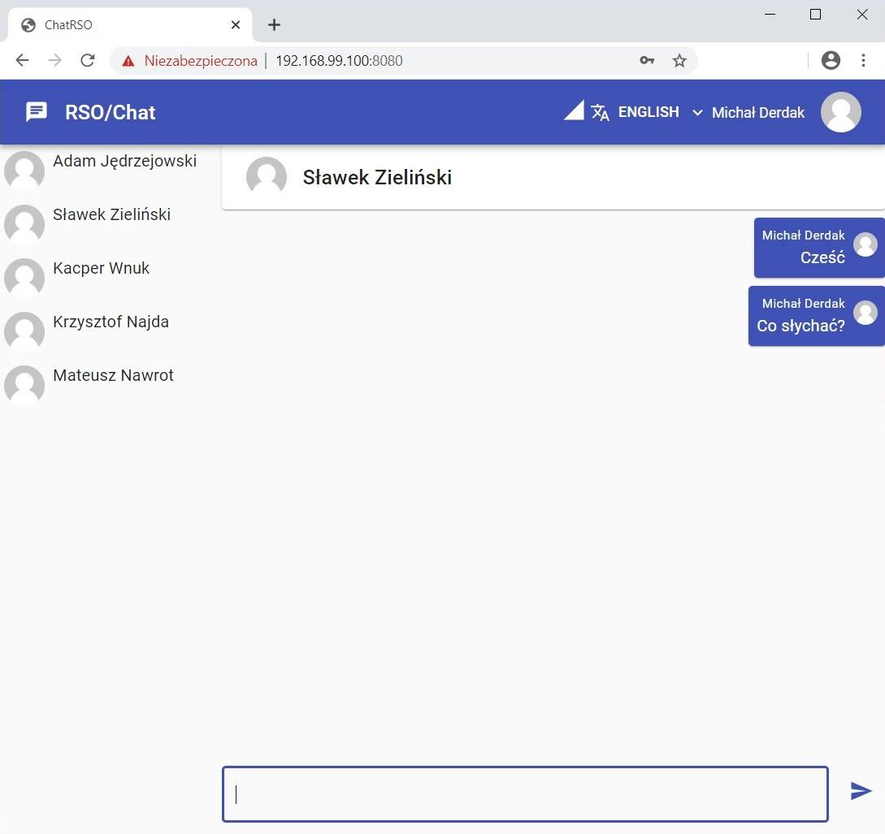

## Prezentacja działania aplikacji
Nowi użytkownicy mają możliwość zarejestrowania się poprzez formularz rejestracyjny dostępny po kliknięciu "Zarejestruj się"/"Sign Up". W ramach czatu można wybrać wersję językową: angielską lub polską. Niepoprawne wartości pól formularza zostają zaznaczone na czerwono. Po rejestracji użytkownik jest automatycznie zalogowywany. Z panelu użytkowników po lewej stronie użytkownik wybiera z kim chce prowadzić konwersację. Użytkownik ma możliwość wczytania historii wiadomości poprzez naciśnięcie przycisku "Wczytaj poprzednie wiadomości".

## Panel administratora

Jako Panel administracyjny użyto serwera ssh. Do serwera przesyłane są pliki .yml zawierające dane zapytania (przykładowo stworzenia nowych użytkowników). Serwer przetwarza dane i zwraca wynik zapytania.

